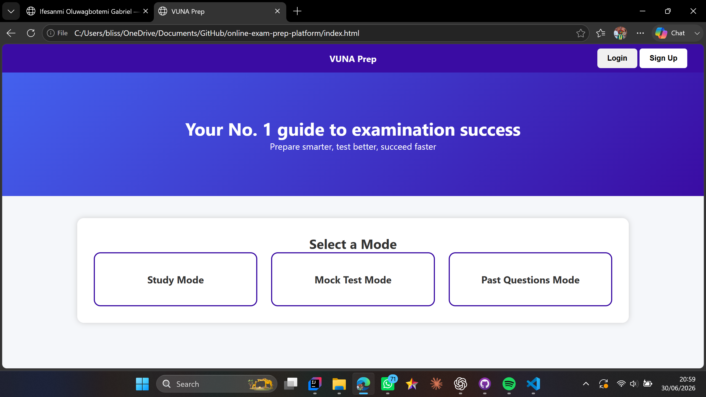
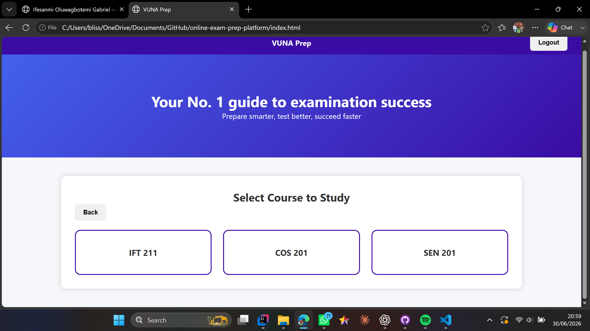
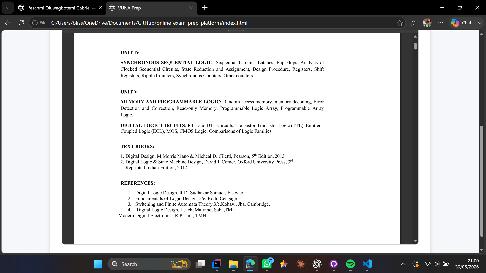
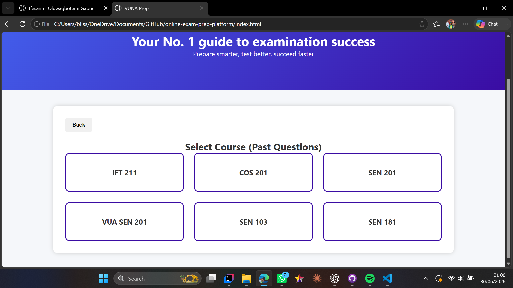
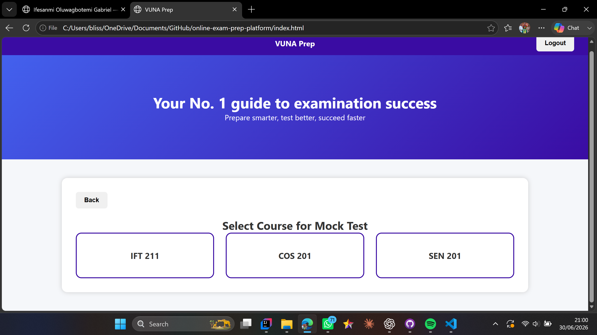

# Online Tutoring & Exam Preparation Platform

A full-stack web application designed to help students prepare effectively for examinations through structured learning and assessment tools. The platform provides multiple study modes that allow users to learn course content, practice past questions, and evaluate their readiness through mock examinations.

## Features

* Structured Study Mode for learning course materials
* Past Questions Mode for revision and practice
* Mock Test Mode for exam simulation
* Question and answer management
* Progress-oriented learning experience
* Responsive web interface
* Database-backed content management

## Technologies Used

### Frontend

* HTML
* CSS
* JavaScript

### Backend

* Node.js

### Database

* PostgreSQL

## Screenshots

### Landing Page

### Study Mode

### Course Select To Study

### Course Study

### Past Questions

### Mock Test

## Project Overview

This platform was developed to address a common challenge faced by students: managing exam preparation efficiently. Rather than switching between multiple resources, students can access study materials, practice questions, and assessment tools from a single platform.

The project was planned using software engineering principles, with system structure and functionality considered before implementation. The result is a platform that separates frontend presentation from backend services and database management.

## Key Learning Outcomes

Through this project, I gained practical experience in:

* Full-stack web development
* Frontend and backend integration
* Database design and management
* Application architecture
* User interface design
* Problem-solving and software planning

## How to Run

1. Clone the repository.
2. Install project dependencies.
3. Configure the PostgreSQL database.
4. Start the backend server.
5. Open the application in your browser.

## Future Improvements

* User authentication
* Personalized study analytics
* Performance tracking dashboard
* AI-assisted study recommendations
* Mobile application version

## Author

Ifesanmi Oluwagbotemi Gabriel

Software Engineering Student | Full-Stack Developer
